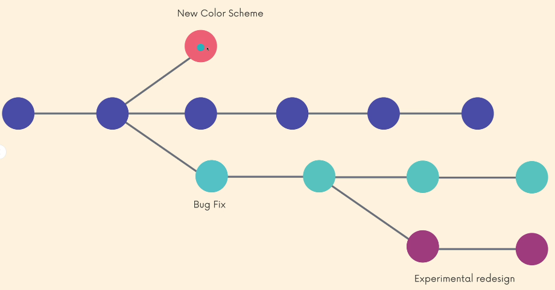
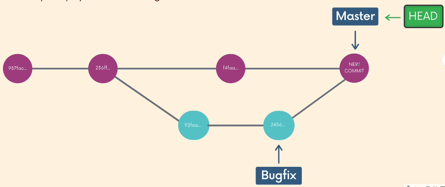

# Branches
    
Branches enable us to work on multiple ideas in parallel. If we make changes on one branch, they do not effect the other branches (unless we merge the branches).

In git we are always working on a branch, the default one is `master` .

**Head** : Head is a pointer that refers to the current branch in your repo.
    
- `git branch` - List all existing branches. The branch that has a `*` in front of it is the branch we are currently on.
- `git branch branch-name` - Create a new branch, based upon the current HEAD . It does not switch to the branch.
- `git switch branch-name` - Switch to a different branch. There is an older command which is `git checkout branch-name`
- `git switch -c branch-name` - Creates a new branch and switches to it.
- `git branch -d branch name` - Deletes the specified branch, you can’t delete a branch if you’re in it.
- `git branch -m new-name` - Renames the branch, you have to be on the the branch to rename it.
 

##### Switching Branches With Unstaged Changes

>    💡 When you have unstage changes they will come with you to the branches you switch to, if you have uncommitted changes git will yell at you.

 

***

## Merging
    
We merge branches, not specific commits. And we always merge to the current head branch.

 `git merge branch-name` - Merges changes from the branch that’s specified into the current branch.
  

   Note that the merge command works **automatically** only when there is **no conflic**t between the branches that you want to merge.

  When there isn’t a conflict, but commits were made in the branch that you want to merge into, git preforms a “merge commit”. 

  

 When you **do** **encounter** a merge **conflict** git will let you know in which files, follow these steps to resolve it:

1. Open the file(s) with the merge conflict.
2. Edit the file(s) to remove the conflict.
3. Remove the conflict “markers” in the documents.
4. Add the changes and make a commit.

---
## diff

Shows changes between commits, branches, files, the working directory and more.
    
  - `git dif` - Lists all of the changes in our working directory that are **not staged** for the next commit.
  - `git diff HEAD`   - Lists **all changes** (staged and unstaged) in the working tree since your last commit. Can do the same but with a file: `git diff HEAD filename` .
  - `git diff --staged` or `--chached` - Lists the changes between the staging area and our last commit. “show me what will be included in me commit if i run git commit now” . Can do the same but with a file: `git diff --staged filename`  or `--chached filename` .
  - `git diff branch1..branch2` or `git diff branch1 branch2`- List the changes between the tips of two branches.
  - `git diff commit1..commit2` or `git diff commit1 commit2`- Compares two commits, provides git diff with the commit hashes (the long “serial number”) of the commits in question.

---

 ## Stashing

What will happen if you switch to another branch when you have uncommitted files?
    
Well one of two:

1. Your changes **come with you** to the destination branch.
2. Git **won’t let you switch**  if it detects potential conflict.

For these things **not to happen**, Git provides an easy way of stashing uncommited changes so that we can return to them later, without having to make unnecessary commits. 

- `git stash` - Saves changes (staged and unstaged) that you are not ready to commit. You can stash changes and then come back to them later.
- `git stash pop` - Removes the most recently stashed changes in your stash and re-apply them to your working copy.
- `git stash apply`  - Applies whatever is stashed away, without  removing it from the stash. This can be useful if you want to apply stashed changes to multiple branches.
- `git stash list` - You can add multiple stashes onto the stack of stashes. They will be stashed in the order you added them. So this command will list all of the stashes you added by order of stashing.
- `git stash apply stash@{the stash number}` - You can specify a particular stash that you want to apply.