

  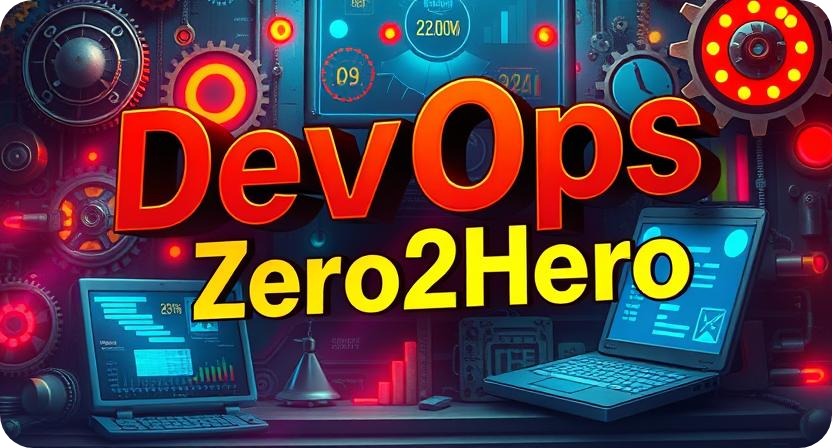

---

<!-- LOGOS START -->

Total markdown files found: 34

|                                                                                                                                                                            |                                                                                                                                                                           |                                                                                                                                                                                       |                                                                                                                                                                                    |                                                                                                                                                                   |                                                                                                                                                                           |                                                                                                                                                                       |                                                                                                                                                                  |
| -------------------------------------------------------------------------------------------------------------------------------------------------------------------------- | ------------------------------------------------------------------------------------------------------------------------------------------------------------------------- | ------------------------------------------------------------------------------------------------------------------------------------------------------------------------------------- | ---------------------------------------------------------------------------------------------------------------------------------------------------------------------------------- | ----------------------------------------------------------------------------------------------------------------------------------------------------------------- | ------------------------------------------------------------------------------------------------------------------------------------------------------------------------- | --------------------------------------------------------------------------------------------------------------------------------------------------------------------- | ---------------------------------------------------------------------------------------------------------------------------------------------------------------- |
| <a href="././ansible/">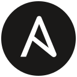</a>  Ansible&nbsp; |   Argocd&nbsp;[1] |   Aws&nbsp;[7]                      | <a href="./#">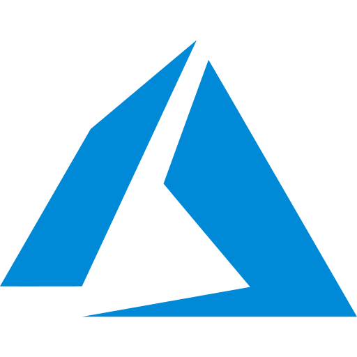</a>  Azure&nbsp;                      |   Bash&nbsp;       | <a href="./#">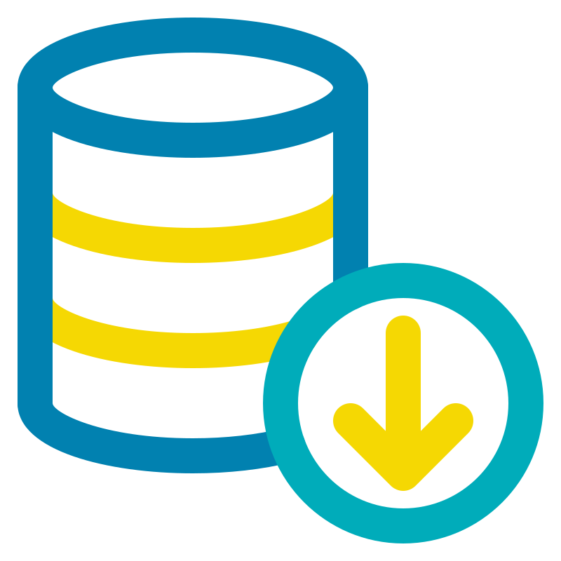</a>  Bigdata&nbsp;         |   Bitbucket&nbsp; | <a href="./#">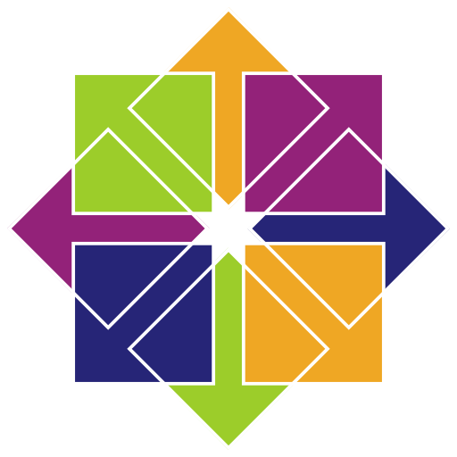</a>  Centos&nbsp;  |
|   Cicd&nbsp;                | <a href="./#">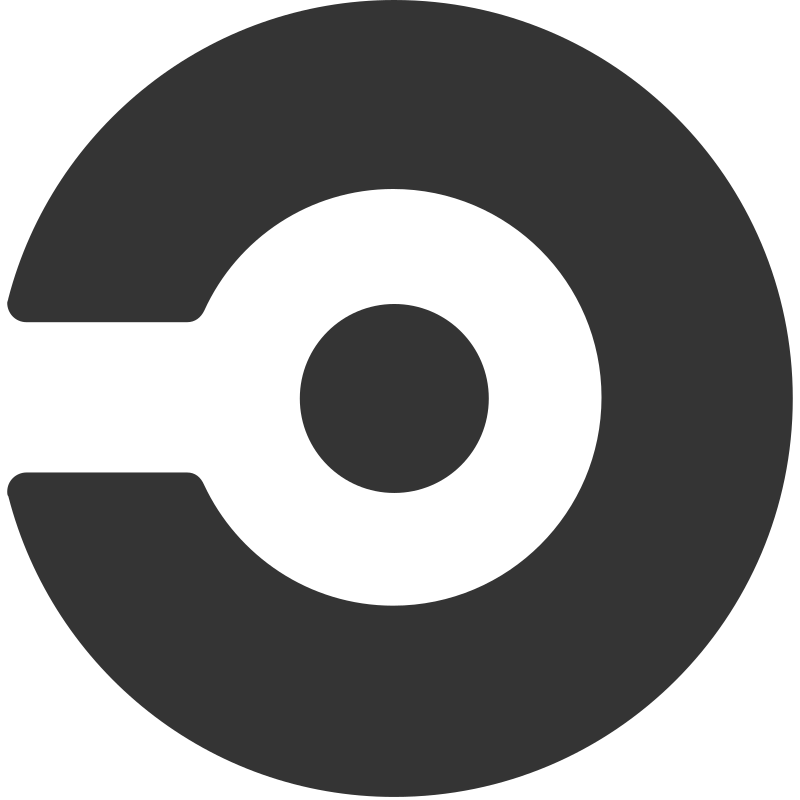</a>  Circleci&nbsp;       | <a href="./#">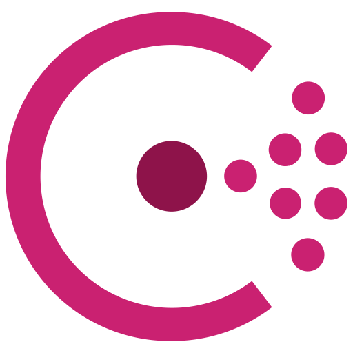</a>  Consul&nbsp;                       |   Container&nbsp;              |   Datadog&nbsp; |   Docker&nbsp;[3] |   Gcp&nbsp;             | <a href="././git">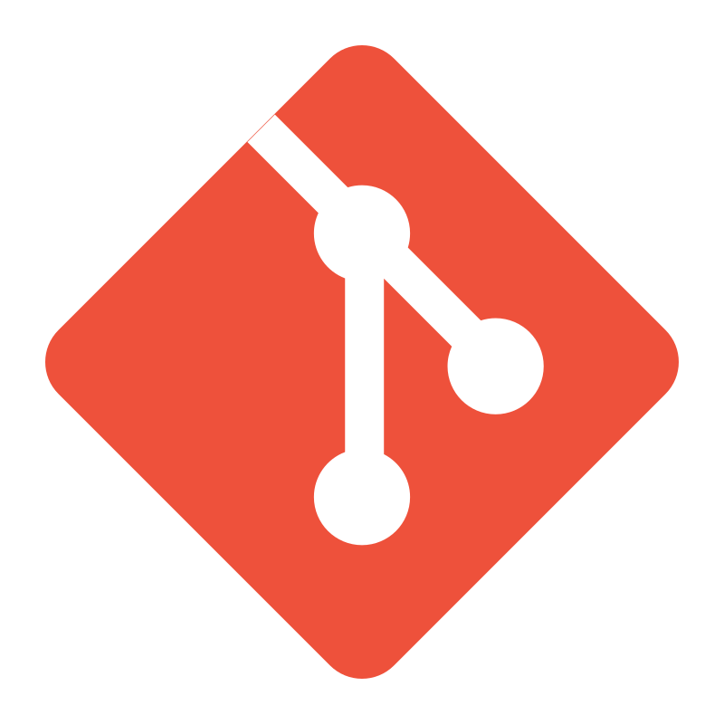</a>  Git&nbsp;[7] |
|   Github&nbsp;            | <a href="./#">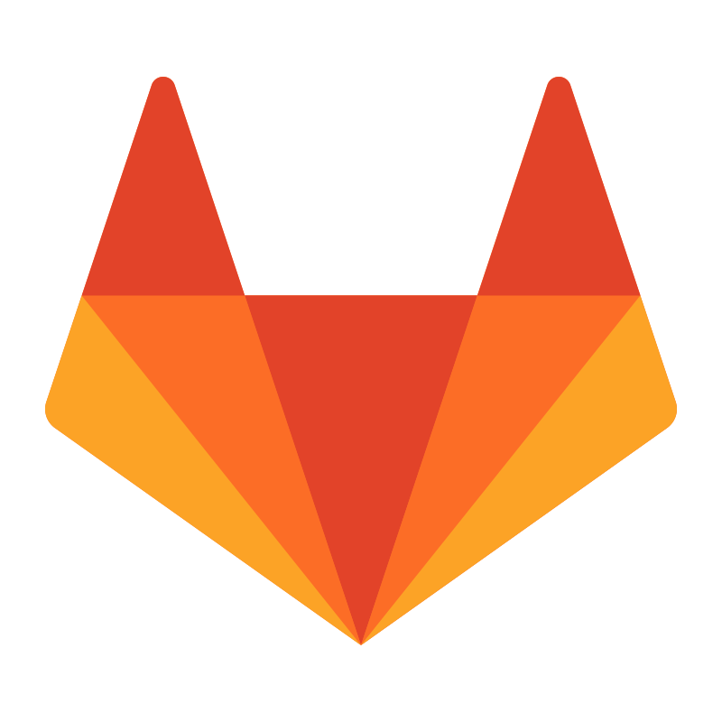</a>  Gitlab&nbsp;           | <a href="./#">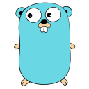</a>  Go&nbsp;                               |   Grafana&nbsp;                  |   Helm&nbsp;       |   Istio&nbsp;             |   Jenkins&nbsp;     |   Jira&nbsp;      |
|   K3s&nbsp;                  |   Kibana&nbsp;           |   Kubernetes&nbsp;[4] |   LinkedIn&nbsp;                |   Linux&nbsp;     |   Logstash&nbsp;       |   Markdown&nbsp;   | <a href="./#">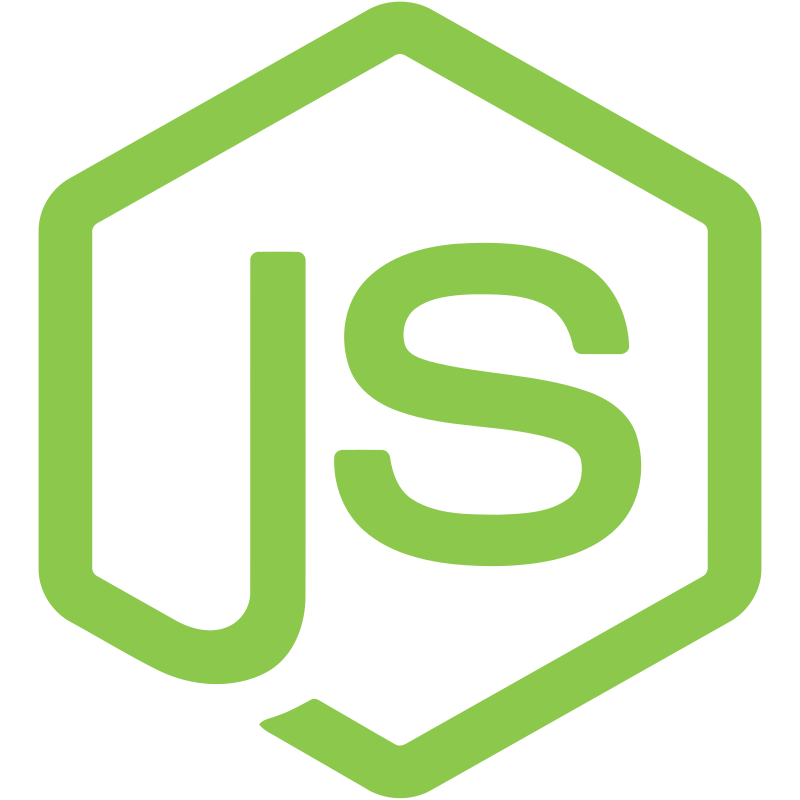</a>  Nodejs&nbsp;  |
|   Packer&nbsp;            | <a href="./#">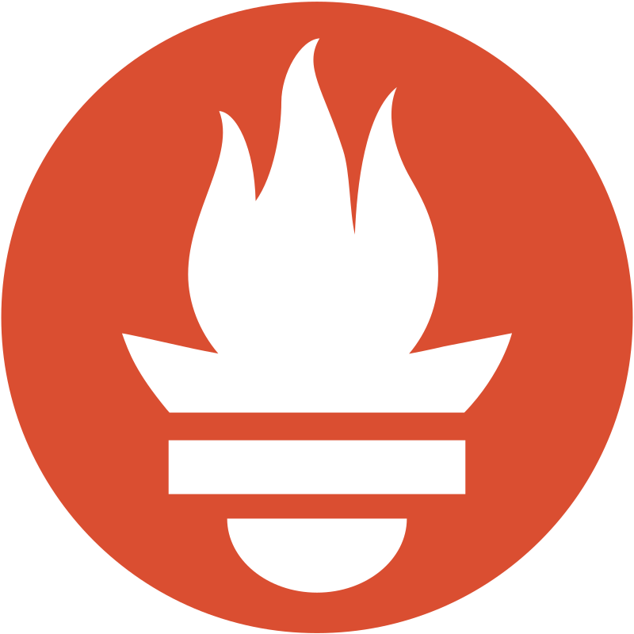</a>  Prometheus&nbsp;   | <a href="./#">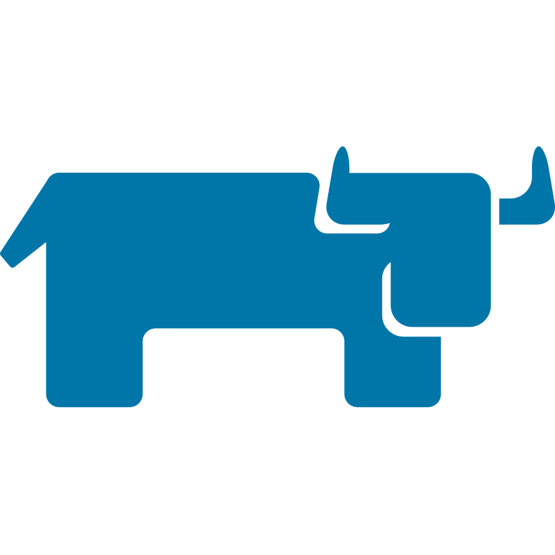</a>  Rancher&nbsp;                     | <a href="././terraform">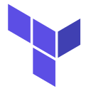</a>  Terraform&nbsp;[4] |   Ubuntu&nbsp;   |   Vagrant&nbsp;         |   Vault&nbsp;         |   Vercel&nbsp;  |
|   Vim&nbsp;                  |   Vscode&nbsp;           |   Windows&nbsp;                     |   Yaml&nbsp;                        |   Crane&nbsp;     |                                                                                                                                                                           |                                                                                                                                                                       |                                                                                                                                                                  |

<!-- LOGOS END -->
