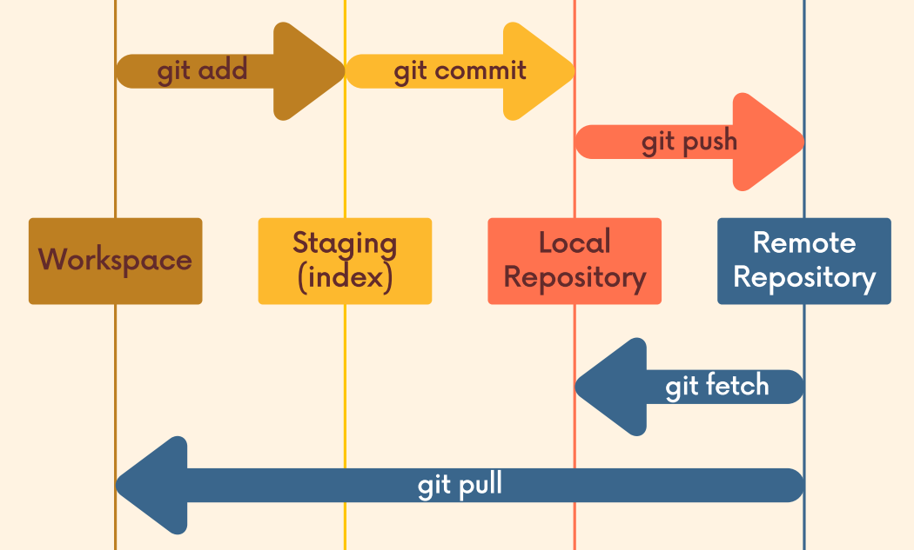

See the Git documentation for more info: [Git - Documentation](https://git-scm.com/doc)

# What Is Git?

>    💡  Git is a **version control system** that   helps users **track changes** in their files, collaborate efficiently, and revert to previous versions if needed. It also ensures that multiple people can work on the same project without conflicts.

 

# Repositories
    
## What’s a repository?

A repository (repo) is a storage location where all the files, history, and version tracking information for a project are kept.

## Git has 2 repositories types:

1. **Local repository** - Stored on your own machine.
2. **Remote repository** - Hosted in a git server.

### Local Repository - Consists of 3 stages

**1. Working stage**
- This is where you **create, edit, and modify files**.
- Files in this area are **not yet tracked** by Git or have been modified after the last commit.

**2. Staging stage**
- Acts as **the middle step** between the working area and the local repository.
- Allows to **prepare and review** changes **before** officially saving them in a **commit**.

**3. Commited Files**
- Where **committed changes** are stored permanently.
- Every commit acts as a **snapshot** of the project at a specific time.
    
---

## Basic Commands
- `git init` - Initialize a new Git repository in your working directory
    
    A GIT “Repo” is a workspace which tracks and manages files within a folder.
    
- `git status` - Reports the status of a Repo
- `git add file[s]` - Adds a file to the staging area

**Commit Commands**
- `git commit -m "message"` - Record changes to the repository with a message
- `git commit --amend` - Redoes the previous commit.
- `git log` - Shows commit history for the given Repo.

  **Ignoring Files**
    
    For when you don’t want GIT to track certain files:
    
    Create a file named `.gitignore`, write inside it all the `files` or the `directories/` you want git to ignore, one line at a time.
    

### A  step by step
1. First, initialize a repository by going to the project folder and initializing git:

    `git init`

2. Work on staff, you are now in the working area. Once you’re finished you can check the status of your work:

    `git status`

3. You ready to go to the staging area? great!

    `git add file[s]`

    Just write in the end of the command the files that you want to stage.

4. Ready to commit?

    `git commit -m "good description"`

    Don’t forget to add a description of the changes that you made.

5. Want to check on your commits?
    `git log`
    

