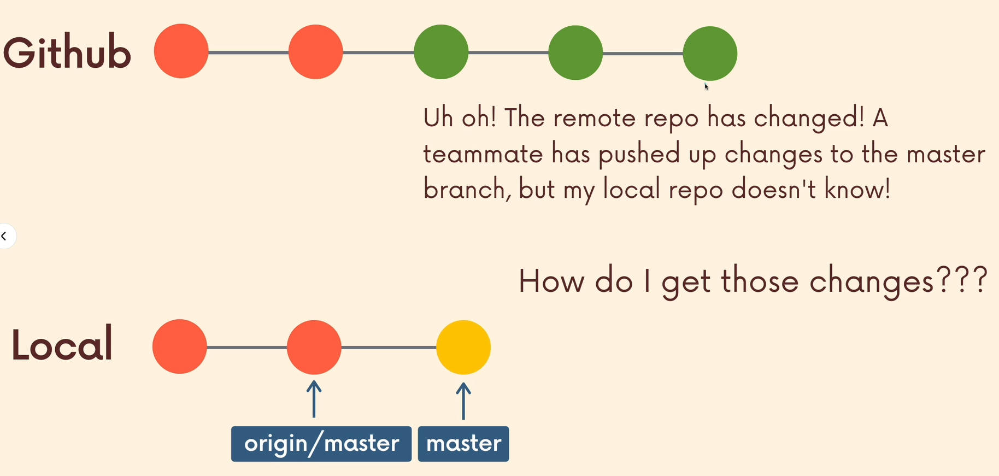
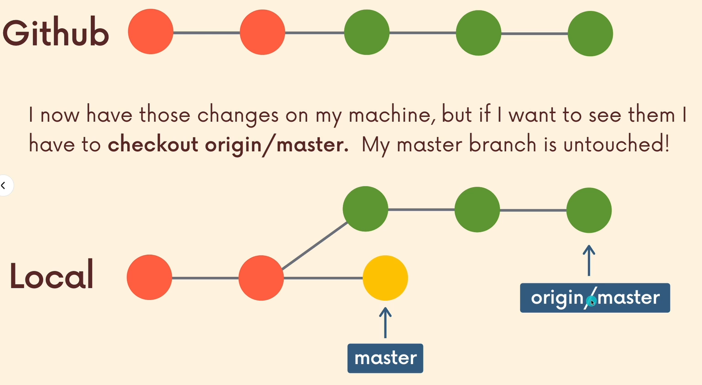
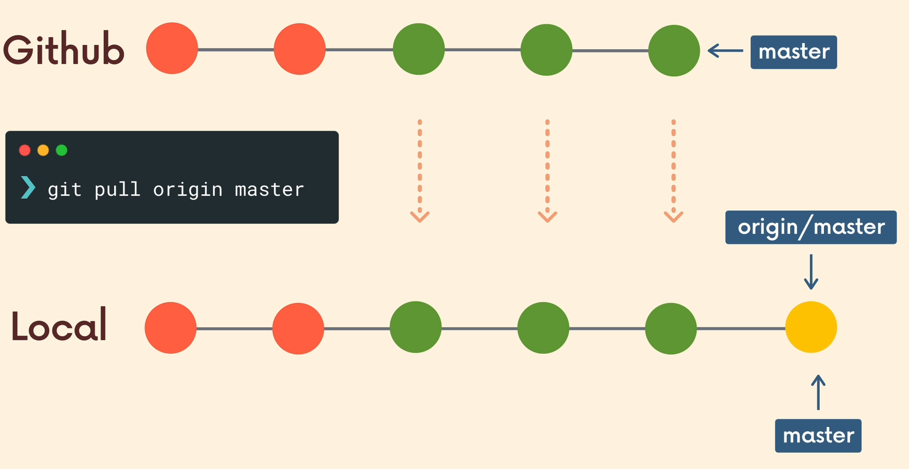

# GitHub
    
GitHub is a web-based platform for version control and collaboration, allowing multiple people to work on projects at once. It's built on Git and is used to host and manage code repositories.

You can have public or private repositories in GitHub:
- Public repositories can be viewed by anyone.
- Private repositories are accessible only to invited collaborators.

---

### Cloning a repository

Often we would want to get a local copy of an existing GitHub repository instead of creating a Git repository from scratch, we can do it by cloning it.

- In git hub go to the repository you want to clone.
- Click on the green "Code" button and copy the repository URL.
- In your terminal, in the preferd directory, copy the URL to the command:
`git clone https://github.com/username/repository.git`

This will create a directory with the repository's name and it will contain all the files from the remote directory, giving you access to the full Git history of the cloned project and now you can start making changes locally.

---

### Push
After making and commiting changes locally, you can push those changes back to the remote repository in GitHub.

- `git push origin branch` - Pushes the specified branch up to the remote repository.

- `git push -u remote branch` - Sets up the local branch to track the remote branch you just pushed to. After doing this once, you can simply use `git push` and `git pull` without specifying the remote and branch name again, and Git will know which branch you mean based on the upstream setting.

---

### Fetching And Pulling
    
When working with others, the remote repository on GitHub may have changes that you need to incorporate into your local repository.     

There are two main ways to update your local repository with changes from GITHub:

**Fetching**

Fetching downloads the latest changes from the remote repository, but it doesn't automatically merge those changes into your local repository. It's useful for checking what changes are available before incorporating them.

`git fetch origin ` - Fetches all changes from the origin remote repository

**Pulling** 

Pulling is a combination of fetching and merging. It fetches the latest changes from the remote repository and then merges them with your local branch, automatically updating your local files.

`git pull origin branch` - Fetches the latest information from the origins specified branch (usually main) and meges those changes into the current branch.

    

---

### Remote tracking branches

When cloning a repo, we now have a git repo in our machine. The only difference is that now we have another branch that isn’t on the github repo named “remote tracking branch”. It's pointing to the last known commit on the branches on the remote repository. 
They are read-only references, You cannot directly edit remote tracking branches, but you can fetch and merge changes from them.
They are prefixed with the remote's name, usually `origin/branch-name`.

- `git branch -r` - Shows the remote branches our local repo knows about.

- `git checkout origin/master` - Switches to the remote tracking branch in detached HEAD.

- `git switch -c local-branch origin/remote-branch` -  Creates a new local branch that starts at the current state of the `origin/remote-branch` and set to track it.
---

### How do i get my repository into GitHub?

 If you already have an existing repo locally that you want to get on GitHub - 
  1. Create a new repo on GitHub (the green "New' button) and fill what you need to, this will create an empty repository.
  2. Set your GitHub repository  as the remote, you can get the URL by clicking on the gren "Code" button.
  `git remote add origin https://github.com/username/repository-name.git`
  3. Push your changes to GitHub:
  `git push -u origin master`

---

 ## Collaboration Workflow

**Centralized Workflow** - AKA everyone works on a single branch , it’s straightforward and can work for small teams.
    
**Feature Branches** - All new development is done on separate branches, master is treated as the official project history.

### Forking :

Allows you to create personal copies of other peoples repos. We call those copies a “fork” of the original. If you want to share your work, you can make a pull request from your fork to the original repo.

1. Go to the GitHub repository you want to fork.
2. Click on the "Fork button".
3. GitHUb will create a copy of the repository under your GitHub account.
4. Clone your forked repository to your local machine.
`git clone URL-of-your-forked-repo`
5. If you want your forked repository to be in sync with the original repository, you can set upstream remote.
`git remote add upstream URL-of-the-original-repo`
6. It's best to create a new branch for the the changes that you want to make.
`git switch -c branch-name`
7. Do what you need to do, don't forget to commit.
8. Push the changes to your fork in GitHub.
`git push origin your-branch`
9. Make a **Pull Request**:
PR allow developers to alert team-members to new work that needs to be reviewed . They provide a mechanism to approve or reject the work on given branch and they help facilitate discussion and feedback on specified commits.
  -- Go to your GitHub repository, it will prompt you to make a pull request, click on it.
  -- Fill everything and click on "Create pull request".
This creates a pull request in the original repository, where the repository owner can review and merge your changes.

