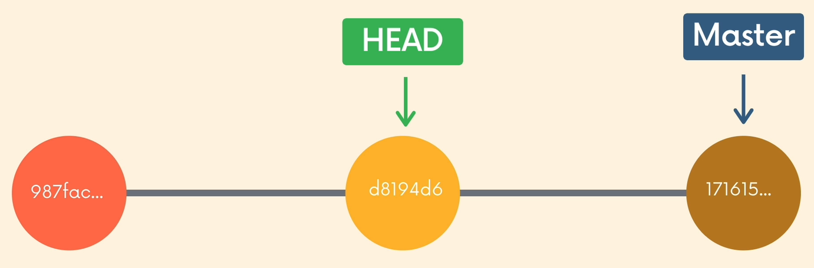

## Time Traveling
    
    

>💡 HEAD usually points to the latest commit on a branch. "Detached HEAD" state means that your HEAD  is now pointing directly to a specific commit, tag, or remote branch, rather than to a named branch.
Basically this means **you can travel to any point in the projects history**.

---

- `git checkout commit-hash`  - Enters the "Detached HEAD" state and refers to the commit of your choosing. You can use `git log --oneline` to view commit hashes. We need the first 7 digits of a commit hash.
- `git checkout HEAD~n` - Refers to n commits before the current HEAD.

When you’re in detached HEAD state you have a couple of options:

1. Stay in detached HEAD to examine the contents of the old commits. Poke around, view the files etc.
2. Go back to whatever branch you were on before or go to another branch - reattach the HEAD. 
    
    `git switch -` which will take you to the last branch you were on.
    `git switch branch-name` - willl switch to whatever branch you will provide.
    

---

- `git checkout HEAD file[s]` or `git checkout -- file[s]` or `git restore file[s]` - Discards any changes in that file, reverting back to to it's state in the commit that HEAD is pointing to.
- `git restore --source [HEAD~n] [commit-hash] file[s]` - Restores the file to its state from the n commits prior to HEAD or from the commit specified.
- `git restore --staged file[s]` - Unstages staged files.
- `git reset commit-hash` - Resets the branch back to a specific commit. The commits that came after it are gone, but the changes that were made in the files remain.
- `git reset --hard commit-hash` -  Resets the branch back to a specific commit, but this time ,undoes both the commits and the actual changes in the files.
- `git revert commit-hash` - Creates a new commit which undoes the changes from the specified commit but does not erase the commit itself and the commit history stays intact.