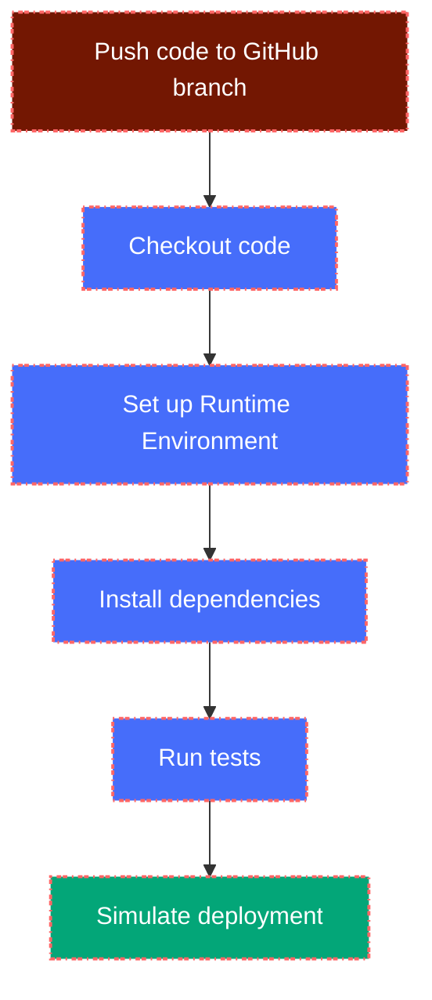

<!-- omit in toc -->
<div align="center">
  
</div>

---

# 1. GitHub Actions CI/CD

## 1.1. Table of Content

- [1. GitHub Actions CI/CD](#1-github-actions-cicd)
  - [1.1. Table of Content](#11-table-of-content)
  - [1.2. ❓What is GitHub Actions?](#12-what-is-github-actions)
  - [1.3. 🛠️Example of a simple CI/CD Workflow using GitHub Actions (Python)](#13-️example-of-a-simple-cicd-workflow-using-github-actions-python)
  - [1.4. 🧠Diagram of the Workflow](#14-diagram-of-the-workflow)
  - [1.5. 💡Tips for Beginners](#15-tips-for-beginners)
  - [1.6. 📖Useful Resources](#16-useful-resources)

---

<div align="center">
  
</div>

---

## 1.2. ❓What is GitHub Actions?

- **GitHub Actions** is a continuous integration and continuous delivery `(CI/CD)` platform that allows you to automate your build, test, and deployment pipeline.
- It enables you to create workflows that build, test, package, release, and deploy your code right from your GitHub repository.
- You can define your workflow in a `YAML` file located in the `.github/workflows` directory of your repository.
- Workflows can be triggered by various events, such as:
  - Push to a branch
  - Pull request creation
  - Scheduled events (cron jobs)
  - Manual triggers
- **GitHub Actions** supports a wide range of programming languages and frameworks, making it versatile for different projects.
- You can use pre-built actions from the GitHub Marketplace or create your own custom actions.
- It integrates seamlessly with other GitHub features, such as issues, pull requests, and releases.
- **GitHub Actions** provides a free tier for public repositories and a limited number of free minutes for private repositories, making it accessible for open-source projects and small teams.
- It allows you to run your workflows on GitHub-hosted runners or self-hosted runners, giving you flexibility in your CI/CD setup.
- **GitHub Actions** provides built-in support for secrets management, allowing you to securely store and use sensitive information like API keys and credentials in your workflows.
- It has a rich ecosystem of community-contributed actions, enabling you to leverage existing solutions for common tasks.
- **GitHub Actions** provides detailed logs and insights into your workflow runs, making it easy to debug and monitor your CI/CD processes.

---

## 1.3. 🛠️Example of a simple CI/CD Workflow using GitHub Actions (Python)

- This is a basic CI/CD pipeline using **GitHub Actions** for a Python project.
- It includes steps for checking out the code, setting up Python, installing dependencies, running tests, and simulating a deployment.
- It runs automatically on every push to the `main` branch and includes the following steps:

  - Checkout the code.
  - Set up Python.
  - Install dependencies from `requirements.txt`.
  - Run test suite (using `unittest` or `pytest`).
  - Simulate a deploy step (for demonstration purposes).

```yaml
# The name of the workflow
name: Simple Python CI/CD

# The trigger for the workflow
# This workflow will run on every push to the main branch
on:
  # You can also use other events like pull_request, schedule, etc.
  # For example, to run on pull requests:
  # pull_request:
  #   branches: [ "main" ]
  # To run on a schedule (e.g., every day at midnight):
  # schedule:
  #   - cron: '0 0 * * *'
on:
  push:
    branches: [ "main" ]

# The jobs that will run in this workflow
# Each job runs in a separate environment

jobs:
  # Define a job named "build-and-deploy"
  build-and-deploy:
    # The job will run on the latest version of Ubuntu
    runs-on: ubuntu-latest

    # Define the steps that will be executed in this job
    steps:
      # Step 1: Checkout the code from the repository
      - name: Checkout repository
        uses: actions/checkout@v3

      # Step 2: Set up Python
      # This step sets up Python 3.10 for the workflow
      - name: Set up Python
        uses: actions/setup-python@v4
        with:
          python-version: '3.10'
  
      # Step 3: Install dependencies (using pip)
      - name: Install dependencies
        run: |
          python -m pip install --upgrade pip
          pip install -r requirements.txt

      # Step 4: Run the test suite
      # This step runs the test suite using unittest or pytest
      # You can replace this with your preferred testing framework
      # For example, if you are using pytest, you can use:
      # - name: Run tests
      - name: Run tests
        run: |
          echo "Running tests..."
          python -m unittest discover tests

      # Step 5: Simulate deployment
      # This step simulates a deployment step
      # In a real-world scenario, you would replace this with your deployment command
      # For example, if you are deploying to AWS, you might use:
      # - name: Deploy to AWS
      #   run: aws deploy push --application-name my-app --s3-location s3://my-bucket/my-app.zip    
      # For this example, we will just echo a message
      - name: Deploy (simulated)
        run: echo "🚀 Deploying the Python app..."
```

## 1.4. 🧠Diagram of the Workflow

- The diagram below illustrates the flow of the CI/CD pipeline using **GitHub Actions**.
- It shows how the workflow is triggered by a push to the `main` branch, followed by the steps of checking out the code, setting up Python, installing dependencies, running tests, and simulating deployment.
- Each step is represented as a box, and the arrows indicate the flow of execution.
- The diagram helps visualize the sequence of actions and the overall structure of the CI/CD pipeline.
- The workflow is designed to be simple and easy to understand, making it a great starting point for beginners.



---

## 1.5. 💡Tips for Beginners

- Always test your workflow in a separate branch before merging.
- Use `secrets` in GitHub to store credentials (like API keys, AWS Credentials, kubeconfig).
- Check the [Actions Marketplace](https://github.com/marketplace?type=actions) to find reusable actions.

---

## 1.6. 📖Useful Resources

- [GitHub Actions Docs](https://docs.github.com/en/actions)
- [Awesome Actions](https://github.com/sdras/awesome-actions)
- [Actions Marketplace](https://github.com/marketplace?type=actions)

---
