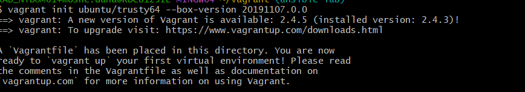

## What is Vagrant?

Vagrant is an open-source tool developed by **HashiCorp**. It provides a simple and consistent workflow for managing virtualized development environments. By using Vagrant, developers can create and configure lightweight, reproducible, and portable virtual environments with ease.

## Installation Guide:

Follow the installation page for Linux, Windows or Mac installation:
https://developer.hashicorp.com/vagrant/downloads


## How to use vagrant:
In order to operate, Vagrant uses a configuration file called `Vagrantfile` that defines the settings for your virtual machine, such as the base box, network configurations, synced folders, and provisioning scripts (you can make your own `Vagrantfile` or take a pre-configured one from: https://portal.cloud.hashicorp.com/vagrant/discover).

### Running a Vagrantfile (using pre-configured vagarntfile)

1. **Navigate to the directory**

   ```bash
   cd /path/to/your/vagrant-project

   vagrant init ubuntu/trusty64 --box-version 20191107.0.0
   ```

You will see now this lines and new file called vagrantfile will appear in your directory:




2. **Run the vagrantfile**
    ```bash
    vagrant up --provider=<where you want to deploy the VM, for example virtaulbox>
    ```


3. **connect to the deployed VM**
    ```bash
    vagrant ssh <name of the VM>
    ```
    


