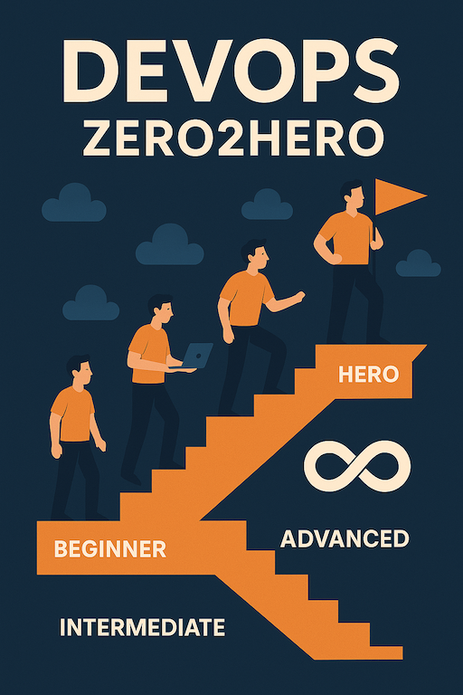

<!-- omit in toc -->
# DevOps-Zero2Hero

- The aim of this project is  to create a startup project that can be used to learn the concepts of DevOps.
- The project will contain DevOps Learning labs.

---

---

### Table of Contents 

- [](#)
  - [Table of Contents](#table-of-contents)
  - [How to contribute to this project?](#how-to-contribute-to-this-project)

---

### How to contribute to this project?

- Fork the repository.
  - Click on the `Fork` and fork this project to your GitHub account.
- Clone the forked repository to your local machine.
  ```sh
  # Clone the forked repository to your local machine
  git clone https://github.com/<your-username>/DevOps-Zero2Hero.git

  # Verify that the project is cloned successfully by checking 
  # the files in the project directory.
  
  # Navigate to the project directory and verify the files.
  cd DevOps-Zero2Hero 
  
  # Verify the files in the project directory.
  git remote -v
  ```

- Contribute to the project.
  - Make changes locally on your local machine (clone).
  - Commit the changes.
  - Push the changes to your forked repository.
  - Create a pull request to the main repository.
  - Add yourself to the list of contributors.
  - Follow the instructions in the pull request to merge your changes.
  - Wait for the project maintainers to review and merge your pull request.

---

- Feel free to contribute to the project
- Use the [discussions](https://github.com/nirgeier/DevOps-Zero2Hero/discussions) tab to discuss the project.

Thank it. AS simple as that!

